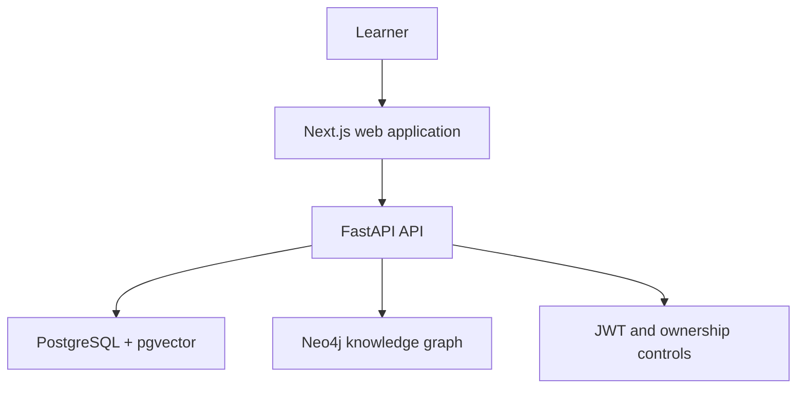
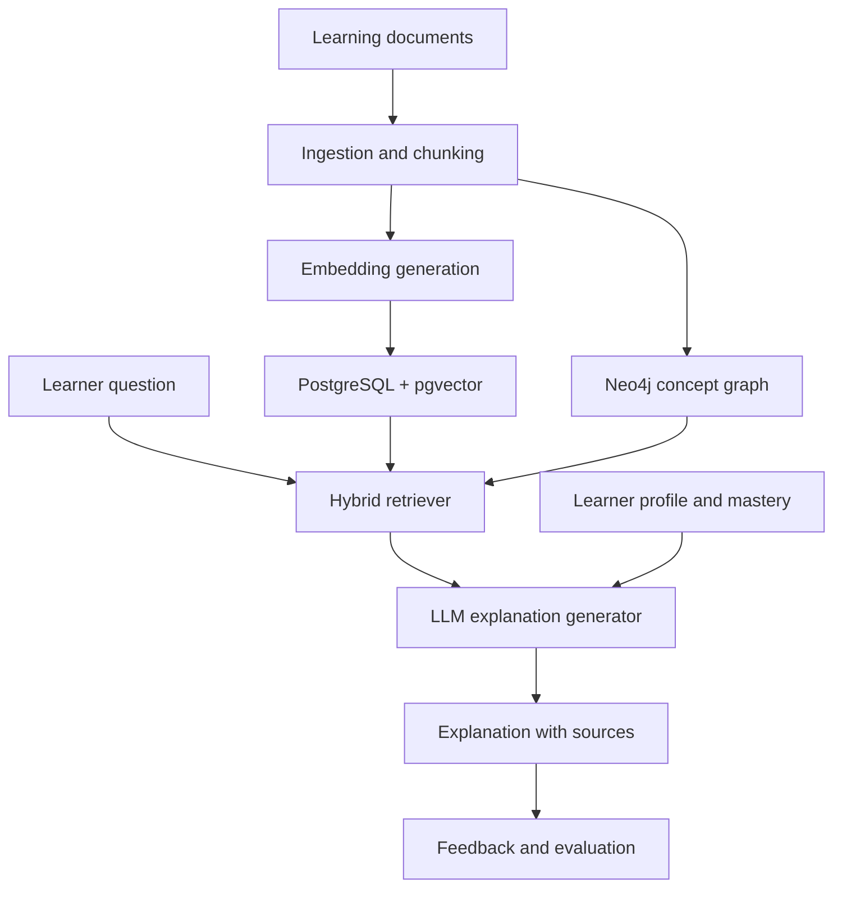

# ExplainatoryRAG

[](https://github.com/AtharvaW29/ExplainatoryRAG/actions/workflows/backend-tests.yml)


**ExplainatoryRAG** is a research-oriented learning platform designed to produce clear, personalized, and evidence-grounded explanations. It combines learner profiles, concept mastery, a Neo4j knowledge graph, explanation sessions, and feedback data as the foundation for an explainable Retrieval-Augmented Generation (RAG) system.

The project currently provides a full-stack application foundation with authentication, protected learner data, PostgreSQL/pgvector persistence, graph traversal, a Next.js interface, database migrations, and integration tests. Document ingestion, embedding generation, hybrid retrieval, LLM generation, Redis, and Celery are the next development stage.

> [!IMPORTANT]
> ExplainatoryRAG is under active development. The platform and data layers are operational, but the end-to-end RAG generation pipeline is not yet complete. See [Implementation status](#implementation-status) for the exact boundary.

## Table of contents

- [Why ExplainatoryRAG?](#why-explainatoryrag)
- [Core capabilities](#core-capabilities)
- [Implementation status](#implementation-status)
- [System architecture](#system-architecture)
- [Technology stack](#technology-stack)
- [Repository structure](#repository-structure)
- [Quick start with Docker Compose](#quick-start-with-docker-compose)
- [Run without Docker Compose](#run-without-docker-compose)
- [Expected output](#expected-output)
- [API overview](#api-overview)
- [Neo4j graph setup](#neo4j-graph-setup)
- [Database migrations](#database-migrations)
- [Testing](#testing)
- [CI/CD](#cicd)
- [Security model](#security-model)
- [Production direction](#production-direction)
- [Roadmap](#roadmap)
- [Troubleshooting](#troubleshooting)

## Why ExplainatoryRAG?

Traditional RAG applications retrieve text and generate a response, but they often provide the same explanation to every learner. ExplainatoryRAG is being designed around a richer learning loop:

1. Understand the learner's profile and current mastery.
2. Identify the target concept and its prerequisites.
3. Retrieve supporting source material.
4. Use graph context to expose relationships and misconceptions.
5. Generate an explanation appropriate to the learner.
6. Capture feedback and evaluation signals.
7. Improve future explanations using the accumulated evidence.

The long-term goal is not merely to answer a question, but to explain **why**, show **how concepts connect**, and adapt the response to the learner's needs.

## Core capabilities

### Application foundation

- FastAPI backend with asynchronous SQLAlchemy sessions.
- Next.js frontend with landing, registration, login, and protected dashboard routes.
- PostgreSQL persistence with Alembic-managed schema migrations.
- `pgvector` columns and vector indexes prepared for semantic retrieval.
- Neo4j concept graph with constraints, indexes, deterministic seed data, and bounded traversal.
- Docker Compose development environment.

### Identity and learner state

- User registration and password-based login.
- JWT bearer authentication.
- Current-user endpoint.
- HTTP-only session cookie integration in the Next.js application.
- Learner profiles and learning preferences.
- Per-user concept-mastery tracking.
- Ownership checks for protected user resources.

### Knowledge and explanation data

- Concept CRUD and soft deletion.
- Concept prerequisites and related-concept relationships.
- Misconception creation, editing, deletion, and concept attachment.
- Explanation sessions and explanation history.
- Learner feedback for generated explanations.
- Evaluation, knowledge-source, document-chunk, and embedding schema foundations.

### Graph exploration

- One-hop concept neighborhoods.
- Graph expansion with a validated depth from `1` to `5`.
- Prerequisite-based learning paths.
- Idempotent graph initialization and development seeding.

### Engineering quality

- Integration tests for authentication.
- Concept CRUD lifecycle tests.
- Ownership and unauthorized-access tests.
- Clean-database Alembic upgrade/downgrade round-trip test.
- GitHub Actions workflow for backend validation.

## Implementation status

| Capability | Status | Notes |
| --- | --- | --- |
| Registration and login | Implemented | JWT authentication with protected routes |
| Frontend authentication | Implemented | HTTP-only session cookie and dashboard protection |
| Learner profiles | Implemented | Create, read, update, and preferences |
| Concept mastery | Implemented | Current-user-scoped reads and writes |
| Concept CRUD | Implemented | Includes soft deletion |
| Neo4j concept graph | Implemented | Initialization, seeding, relationships, and traversal |
| Explanation sessions | Implemented | Persistence and owner-filtered history |
| Feedback | Implemented | Explanation feedback restricted by ownership |
| PostgreSQL migrations | Implemented | Clean baseline validated through upgrade/downgrade |
| Backend integration tests | Implemented | Authentication, CRUD, ownership, and migrations |
| PDF/document ingestion | Planned | Loader, cleaning, and semantic chunking required |
| Embedding generation | Planned | Schema exists; generation pipeline is not connected |
| pgvector similarity search | Planned | Vector columns/indexes exist; retrieval service required |
| Hybrid graph/vector retrieval | Planned | Target Phase C capability |
| LLM explanation generation | Planned | Session schema exists; live generation is not connected |
| Redis and Celery | Planned | Intended for ingestion and generation background jobs |
| Automated RAG evaluation | Planned | Evaluation schema exists; evaluation runner required |

## System architecture

### Current application



### Target RAG pipeline



The production target adds Redis as the message broker/cache and Celery workers for document ingestion, embedding, retrieval preparation, and long-running generation tasks.

## Technology stack

| Layer | Technology |
| --- | --- |
| Frontend | Next.js 16, React 19, TypeScript, Tailwind CSS |
| API | FastAPI, Uvicorn, Pydantic |
| ORM | SQLAlchemy 2 asynchronous API |
| Relational database | PostgreSQL 16 |
| Vector storage | pgvector |
| Graph database | Neo4j 5 Community with APOC |
| Authentication | JWT, bcrypt, HTTP-only cookies |
| Migrations | Alembic |
| Python dependency management | Poetry |
| Testing | pytest, pytest-asyncio, HTTPX |
| Containers | Docker and Docker Compose |
| CI | GitHub Actions |
| Planned asynchronous work | Redis and Celery |

## Repository structure

```text
ExplainatoryRAG/
├── .github/
│   └── workflows/
│       └── backend-tests.yml
├── api/
│   ├── alembic/
│   │   └── versions/
│   ├── src/
│   │   ├── controllers/
│   │   ├── core/
│   │   ├── dependencies/
│   │   ├── graph/
│   │   │   ├── cypher/
│   │   │   └── scripts/
│   │   ├── models/
│   │   ├── routers/
│   │   ├── schemas/
│   │   ├── database.py
│   │   └── main.py
│   ├── tests/
│   │   └── integration/
│   ├── alembic.ini
│   ├── DockerFile
│   └── pyproject.toml
├── app/
│   ├── src/
│   │   ├── app/
│   │   ├── components/
│   │   ├── features/
│   │   ├── lib/
│   │   └── types/
│   ├── DockerFile
│   └── package.json
└── docker-compose.yml
```

## Quick start with Docker Compose

### Prerequisites

- Git
- Docker Engine or Docker Desktop
- Docker Compose v2
- At least 6 GB of available memory recommended

### 1. Clone the repository

```bash
git clone https://github.com/AtharvaW29/ExplainatoryRAG.git
cd ExplainatoryRAG
```

### 2. Configure environment variables

Create a `.env` file in the repository root:

```dotenv
app_DB_USER=user
app_DB_PASSWORD=replace-with-a-strong-password
app_DB_HOST=db
app_DB_PORT=5432
app_DB=explain_rag

JWT_SECRET_KEY=replace-with-a-long-random-secret

NEO4J_URI=bolt://neo4j:7687
NEO4J_USERNAME=neo4j
NEO4J_PASSWORD=replace-with-a-strong-password
```

Copy the same file to `api/.env`, because the API service loads that location:

```bash
cp .env api/.env
```

PowerShell:

```powershell
Copy-Item .env .\api\.env
```

Never commit either environment file.

### 3. Start the databases

```bash
docker compose up -d db neo4j
```

Check their health:

```bash
docker compose ps
```

### 4. Build the application images

```bash
docker compose build app client
```

### 5. Apply the PostgreSQL schema

```bash
docker compose run --rm app poetry run alembic upgrade head
```

### 6. Initialize and seed Neo4j

```bash
docker compose run --rm app poetry run python -m src.graph.scripts.init_graph
docker compose run --rm app poetry run python -m src.graph.scripts.seed_graph
```

The seed operation is idempotent and can safely be run again:

```bash
docker compose run --rm app poetry run python -m src.graph.scripts.seed_graph
```

### 7. Start the complete application

```bash
docker compose up -d app client
```

Or perform a rebuild and start in one command after the databases have been initialized:

```bash
docker compose up -d --build
```

### 8. Open the services

| Service | URL |
| --- | --- |
| Web application | <http://localhost:3000> |
| FastAPI API | <http://localhost:8001> |
| Swagger UI | <http://localhost:8001/docs> |
| ReDoc | <http://localhost:8001/redoc> |
| Neo4j Browser | <http://localhost:7474> |
| PostgreSQL | `localhost:5432` |

### Stop the application

Preserve database volumes:

```bash
docker compose down
```

Remove containers and all local database volumes:

```bash
docker compose down -v
```

> [!WARNING]
> `docker compose down -v` permanently removes the local PostgreSQL and Neo4j development data.

## Run without Docker Compose

This mode runs FastAPI and Next.js on the host while PostgreSQL and Neo4j may continue running in Docker.

### Backend

From `api/`, create `api/.env` using host database addresses:

```dotenv
app_DB_USER=user
app_DB_PASSWORD=replace-with-a-strong-password
app_DB_HOST=localhost
app_DB_PORT=5432
app_DB=explain_rag

JWT_SECRET_KEY=replace-with-a-long-random-secret

NEO4J_URI=bolt://localhost:7687
NEO4J_USERNAME=neo4j
NEO4J_PASSWORD=replace-with-a-strong-password
```

Install dependencies and apply migrations:

```bash
cd api
poetry install --with dev
poetry run alembic upgrade head
```

Initialize the graph:

```bash
poetry run python -m src.graph.scripts.init_graph
poetry run python -m src.graph.scripts.seed_graph
```

Start FastAPI:

```bash
poetry run uvicorn src.main:app --reload --host 0.0.0.0 --port 8000
```

### Frontend

In another terminal:

```bash
cd app
npm install
npm run dev
```

Configure the frontend API URL when running the backend directly on the host:

```dotenv
NEXT_PUBLIC_API_URL=http://127.0.0.1:8000
```

Place that value in `app/.env.local` and restart the Next.js development server after changing it.

The frontend will be available at <http://localhost:3000>.

## Expected output

### Docker services

After startup, `docker compose ps` should show all four current services running:

```text
NAME                         SERVICE   STATUS
explainatoryrag-app-1        app       Up
explainatoryrag-client-1     client    Up
explainatoryrag-db-1         db        Up (healthy)
explainatoryrag-neo4j-1      neo4j     Up (healthy)
```

Container names may differ depending on the local directory name.

### API smoke test

Docker Compose:

```bash
curl http://localhost:8001/
```

Host-based backend:

```bash
curl http://localhost:8000/
```

Expected response:

```json
{
  "message": "Root API EndPoint",
  "envVAR": "user"
}
```

### Register a user

```bash
curl -X POST http://localhost:8001/auth/register \
  -H "Content-Type: application/json" \
  -d '{
    "name": "Example Learner",
    "email": "learner@example.com",
    "password": "Password123!"
  }'
```

Expected shape:

```json
{
  "id": "generated-user-uuid",
  "name": "Example Learner",
  "email": "learner@example.com",
  "is_active": true
}
```

### Log in

```bash
curl -X POST http://localhost:8001/auth/login \
  -H "Content-Type: application/json" \
  -d '{
    "email": "learner@example.com",
    "password": "Password123!"
  }'
```

Expected shape:

```json
{
  "access_token": "encoded-jwt",
  "token_type": "bearer"
}
```

Use the returned token for protected API requests:

```bash
curl http://localhost:8001/auth/me \
  -H "Authorization: Bearer YOUR_ACCESS_TOKEN"
```

## API overview

The complete interactive API contract is available through Swagger UI at `/docs`.

| Area | Prefix | Capabilities |
| --- | --- | --- |
| Authentication | `/auth` | Register, log in, get current user |
| Users | `/users` | Read and update the authenticated user |
| Learner profiles | `/learner_profile` | Profile CRUD and preferences |
| Concept mastery | `/mastery` | Create/update mastery and list current-user mastery |
| Concepts | `/concept` | Create, read, list, update, and soft-delete concepts |
| Concept relationships | `/concept-relationship` | Add concepts, prerequisites, and related concepts |
| Graph | `/graph` | Neighborhood, bounded expansion, and learning paths |
| Misconceptions | `/misconceptions` | CRUD and concept attachment |
| Explanation sessions | `/explanation_sessions` | Create sessions and retrieve owner-filtered history |
| Feedback | `/feedback` | Create, retrieve, and update explanation feedback |

### Seeded graph examples

Get the neighborhood around the seeded Backpropagation concept:

```bash
curl http://localhost:8001/graph/concept-neighborhood/00000000-0000-0000-0000-000000000004
```

Expand it to depth three:

```bash
curl "http://localhost:8001/graph/expand-graph/00000000-0000-0000-0000-000000000004?depth=3"
```

Retrieve the learning path ending at Neural Network:

```bash
curl http://localhost:8001/graph/learning-path/00000000-0000-0000-0000-000000000005
```

The seeded learning path contains:

```text
Calculus
Derivative
Chain Rule
Backpropagation
Neural Network
```

Invalid graph depths such as `0` or `6` are rejected with HTTP `422`.

## Neo4j graph setup

The application initializes Neo4j constraints and indexes during FastAPI startup. The scripts can also be executed explicitly:

```bash
cd api
poetry run python -m src.graph.scripts.init_graph
poetry run python -m src.graph.scripts.seed_graph
```

The graph currently models:

- Concepts.
- Prerequisite relationships.
- Related concepts.
- Misconceptions.
- Learner and explanation graph foundations.
- Learning-resource graph foundations.

The development seed uses deterministic UUIDs, allowing graph routes and tests to reference stable concepts.

## Database migrations

Alembic is the schema authority. Do not use `Base.metadata.create_all()` to create application tables.

Apply all migrations:

```bash
cd api
poetry run alembic upgrade head
```

Inspect the active revision:

```bash
poetry run alembic current --check-heads
```

Check for model/schema drift:

```bash
poetry run alembic check
```

Expected result:

```text
No new upgrade operations detected.
```

Create a new migration after changing a SQLAlchemy model:

```bash
poetry run alembic revision --autogenerate -m "describe schema change"
```

Always review autogenerated migrations before applying them.

## Testing

### Backend integration suite

The suite uses real PostgreSQL/pgvector databases. Database names must contain `test`; the test fixture refuses to recreate databases without that safeguard.

Start PostgreSQL:

```bash
docker compose up -d db
```

From `api/`, install development dependencies:

```bash
poetry install --with dev
```

Set disposable test-database names.

Bash:

```bash
export app_DB_HOST=127.0.0.1
export app_DB=explainatory_rag_test
export MIGRATION_TEST_DB=explainatory_rag_migration_test
```

PowerShell:

```powershell
$env:app_DB_HOST = "127.0.0.1"
$env:app_DB = "explainatory_rag_test"
$env:MIGRATION_TEST_DB = "explainatory_rag_migration_test"
```

Run all integration tests:

```bash
poetry run pytest tests/integration -v
```

Expected summary:

```text
10 passed
```

Run a focused test file:

```bash
poetry run pytest tests/integration/test_authentication.py -v
poetry run pytest tests/integration/test_crud.py -v
poetry run pytest tests/integration/test_ownership.py -v
poetry run pytest tests/integration/test_migrations.py -v
```

### Static checks

```bash
poetry run ruff check src tests
poetry run mypy src
```

Frontend:

```bash
cd app
npm run lint
npm run build
```

## CI/CD

The backend workflow runs for relevant pull requests and pushes to `main`.

It performs:

1. Repository checkout.
2. Python setup.
3. Poetry configuration validation.
4. Development dependency installation.
5. PostgreSQL/pgvector service startup.
6. Backend integration-test execution.
7. Clean migration round-trip validation through the test suite.

Before merging a pull request, verify that the **Backend tests** workflow is green.

Planned delivery automation:

1. Run backend and frontend quality gates.
2. Build API and frontend container images.
3. Scan images and generate an SBOM.
4. Publish immutable commit-SHA tags to GitHub Container Registry.
5. Apply Alembic migrations as a one-off deployment task.
6. Deploy the Docker Compose production stack.
7. Run health checks and authenticated smoke tests.
8. Roll back to the previous image tag when verification fails.

## Security model

Current controls include:

- Password hashing with bcrypt.
- JWT bearer-token validation.
- HTTP-only frontend session cookies.
- Protected dashboard routing.
- Explicit owner checks for user and learner-profile operations.
- Authenticated-user scoping for mastery records.
- Owner-filtered explanation-session and feedback queries.
- HTTP `401` responses for missing, invalid, and expired tokens.
- HTTP `403` responses for attempted cross-user access.

Production deployments should additionally:

- Use long randomly generated secrets.
- Terminate TLS at a reverse proxy.
- Expose only ports `80` and `443`.
- Keep PostgreSQL, Neo4j, and Redis on an internal Docker network.
- Run application containers as non-root users.
- Pin container image versions.
- Use read-only filesystems where practical.
- Drop unnecessary Linux capabilities.
- Back up PostgreSQL and Neo4j volumes.
- Configure CORS explicitly.
- Add rate limiting and audit logging.

## Production direction

The planned production topology contains six application services plus a reverse proxy:

```text
Reverse proxy
├── Next.js frontend
└── FastAPI API
    ├── PostgreSQL + pgvector
    ├── Neo4j
    └── Redis
        └── Celery worker
```

The FastAPI and Celery services should use the same backend image with different commands. PostgreSQL, Neo4j, and Redis should use their maintained upstream images.

For a resource-constrained deployment:

- Use a multi-stage Next.js build.
- Prefer `python:3.11-slim` for the Python RAG stack unless all native dependencies are proven compatible with Alpine/musl.
- Use Alpine selectively for Node.js, Redis, or the reverse proxy.
- Publish both `linux/amd64` and `linux/arm64` images.
- Set Celery concurrency to `1` initially.
- Enforce container memory limits.

## Roadmap

### Phase 1 — Foundation and persistence

- [x] FastAPI application structure
- [x] Next.js application structure
- [x] PostgreSQL/pgvector and Neo4j development stack
- [x] Authentication and frontend session handling
- [x] Learner, mastery, concept, session, and feedback persistence
- [x] Clean Alembic baseline
- [x] Neo4j query stabilization and deterministic seed
- [x] Ownership enforcement
- [x] Backend integration tests and GitHub Actions

### Phase 2 — One-document ingestion

- [ ] Add PDF upload endpoint
- [ ] Validate file type and size
- [ ] Persist the knowledge-source record
- [ ] Extract and clean document text
- [ ] Implement semantic chunking
- [ ] Generate chunk embeddings
- [ ] Store chunks and vectors in PostgreSQL
- [ ] Queue ingestion through Redis and Celery

### Phase 3 — Retrieval

- [ ] Embed learner questions
- [ ] Implement pgvector similarity search
- [ ] Enrich results using the Neo4j concept graph
- [ ] Add reranking
- [ ] Assemble source-aware context
- [ ] Return similarity scores and source metadata

### Phase 4 — Explanation generation

- [ ] Build learner-aware prompts
- [ ] Connect an LLM provider
- [ ] Generate explanations from retrieved evidence
- [ ] Store prompts, outputs, latency, token usage, and provenance
- [ ] Display explanations and citations in the frontend

### Phase 5 — Evaluation and operations

- [ ] Add automated rubric evaluation
- [ ] Add offline retrieval experiments
- [ ] Add Redis caching and Celery monitoring
- [ ] Add `/health`, `/ready`, and `/metrics`
- [ ] Add structured tracing and observability
- [ ] Build and publish production container images
- [ ] Add automated deployment and rollback

## Troubleshooting

### `Target database is not up to date`

Apply the latest migration:

```bash
cd api
poetry run alembic upgrade head
poetry run alembic current --check-heads
poetry run alembic check
```

### PostgreSQL cannot load `vector`

Confirm the Docker service uses the pgvector image:

```yaml
image: pgvector/pgvector:pg16
```

Then verify the extension:

```bash
docker compose exec db psql \
  -U "$app_DB_USER" \
  -d "$app_DB" \
  -c "SELECT extname FROM pg_extension WHERE extname = 'vector';"
```

### Neo4j connection failure

For Docker Compose:

```dotenv
NEO4J_URI=bolt://neo4j:7687
```

For an API running directly on the host:

```dotenv
NEO4J_URI=bolt://localhost:7687
```

Check the container:

```bash
docker compose ps neo4j
docker compose logs neo4j
```

### Frontend cannot reach FastAPI

Use the URL appropriate to the runtime:

```dotenv
# Next.js running on the host
NEXT_PUBLIC_API_URL=http://127.0.0.1:8000

# Next.js running inside Compose
NEXT_PUBLIC_API_URL=http://app:8000
```

Restart Next.js after changing its environment.

### Reset disposable development data

```bash
docker compose down -v
docker compose up -d db neo4j
docker compose run --rm app poetry run alembic upgrade head
docker compose run --rm app poetry run python -m src.graph.scripts.seed_graph
docker compose up -d app client
```

---

Built as a research prototype for personalized, concept-aware, and evidence-grounded explanations.
